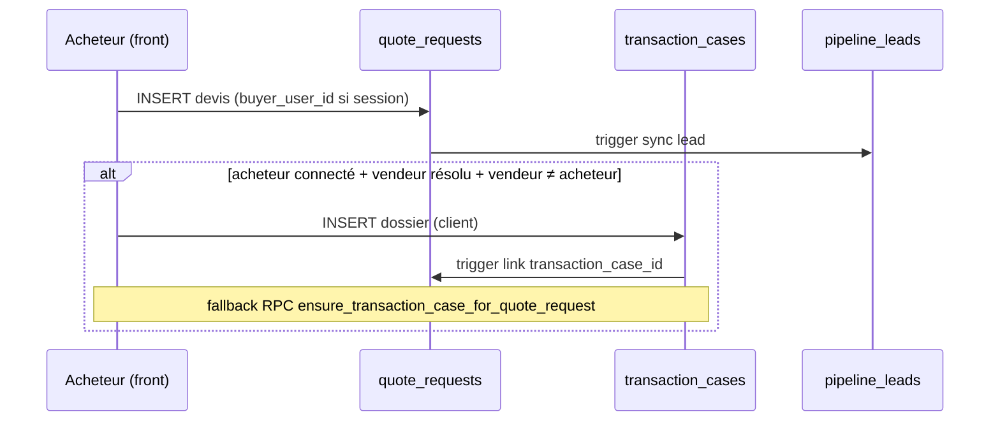

# ARCHITECTURE.md — Minegrid Africa

## Stack technique

| Couche | Technologie |
|--------|-------------|
| **Frontend** | React 18, TypeScript (partiel), Vite 6, Tailwind CSS, hash routing |
| **État / data client** | TanStack React Query 5, Zustand, Context (`AuthContext`) |
| **Backend principal** | Supabase (PostgreSQL + Auth + RLS + Edge Functions Deno) |
| **Paiement** | Stripe (Edge Function `create-payment`, `@stripe/react-stripe-js`) |
| **Monitor** | FastAPI (Python), Postgres dédié, Docker (`services/monitor-service/`) |
| **Cartes / charts** | Leaflet, Recharts, Chart.js, react-grid-layout |
| **Tests front** | Vitest + Testing Library + jsdom |
| **Tests monitor** | pytest (`services/monitor-service/tests/`) |
| **Déploiement** | Vercel (front statique), Supabase cloud, Docker monitor |

## Structure du dépôt (réelle)

```text
/
├── src/                          # Application React principale
│   ├── App.tsx                   # Routage hash, lazy routes
│   ├── main.tsx                  # QueryClientProvider racine
│   ├── contexts/                 # AuthContext
│   ├── components/               # UI partagée + dashboard/widgets
│   ├── pages/                    # Pages + enterprise-shell + widgets/*.js
│   ├── hooks/                    # useAuth, queries/, useExchangeRates
│   ├── utils/
│   │   ├── api/                  # Couche Supabase « générique » (16 fichiers)
│   │   ├── proApi/               # API espace Pro
│   │   ├── enterpriseApi/        # API dashboards métiers
│   │   ├── supabaseClient.ts
│   │   └── supabaseCall.ts       # Helper erreurs (fallback vs throw)
│   └── services/                 # monitorApi, aiWidgetService
├── sql/                          # Scripts migration / patch Supabase (idempotents)
├── supabase/functions/           # Edge Functions (email, paiement)
├── services/monitor-service/     # API Global Monitor
├── docs/                         # Checklists déploiement
├── ai-context/                   # Contexte agents IA (ce dossier)
└── archive/scripts/sql/          # Scripts historiques — ne pas réappliquer sans revue
```

## Routage

- Navigation **hash-based** (`#machines`, `#dossiers`, `#dossier/<uuid>`, etc.) via `src/router/`.
- Routes « application » sans footer global : dashboards, leads, dossiers, monitor (liste `APP_ONLY_ROUTES` dans `App.tsx`).

## Flux données principaux

### 1. Catalogue machines

```
Navigateur → supabase.from('machines').select(...)
           ← RLS détermine visibilité
```

Colonnes vendeur possibles : `sellerid`, `seller_id`, `user_id`, `owner_id` — résolution multi-fallback dans `quoteRequests.ts`.

### 2. Demande de devis → lead → dossier



Fichiers clés :

- Front : `src/utils/api/quoteRequests.ts`, `transactionCases.ts`
- SQL : `sql/quote_requests.sql`, `sql/transaction_platform_core.sql`, `sql/transaction_platform_links_and_triggers.sql`, `sql/rpc_ensure_transaction_case_for_quote_request.sql`

### 3. Dashboards entreprise

```
EnterpriseDashboardShell → useShellState → widgets par métier
                         → WidgetRenderer / renderWidgetContent
                         → enterpriseApi/* + supabase
```

Configurations persistées (localStorage scopé par utilisateur).

### 4. Global Monitor

```
GlobalMonitor.tsx → monitorApi.ts → FastAPI (JWT Supabase)
                                   → auth.require_paid_user_or_admin
                                   → Postgres monitor + Supabase REST (pro_clients)
```

## Couches API (triple pattern)

| Dossier | Usage |
|---------|--------|
| `src/utils/api/` | Messages, offers, quote, transaction, notifications… |
| `src/utils/proApi/` | Espace Pro (documents, profile, users…) |
| `src/utils/enterpriseApi/` | Rentas, inventory, transport, courtier… |

**Dette connue** : logique Supabase dupliquée — consolidation prévue (ticket #10).

## Composants volumineux (points de fragilité)

| Fichier | Lignes approx. | Note |
|---------|----------------|------|
| `WidgetRenderer.tsx` | ~3000 | Rendu central widgets dashboard |
| `Dashboard.jsx` | ~2300 | Legacy client dashboard |
| `EnterpriseDashboard.tsx` | ~1000 | Config entreprise |
| `MachineDetail.tsx` | ~1000 | Fiche + formulaire devis |

## React Query

- Instance unique : `src/queryClient.ts`, provider dans `src/main.tsx` uniquement.
- Vite : `@tanstack/react-query` bundlé avec `react-vendor` (`vite.config.ts`) pour éviter « No QueryClient set ».

## SQL / migrations

- Scripts **idempotents** dans `sql/` — ordre d’exécution documenté dans `sql/VERIFY_LEADS_ET_DOSSIERS.sql`.
- **Ne jamais** exécuter aveuglément `archive/scripts/sql/fix-machines-rls-policies.sql` (policies `USING (true)`).

## Zones sensibles

| Zone | Fichiers / tables |
|------|-------------------|
| Authentification | `AuthContext.tsx`, Supabase Auth |
| Autorisation UI | `ProtectedRoute.tsx`, `permissions.ts` (non branché partout) |
| Autorisation DB | RLS sur `machines`, `quote_requests`, `transaction_cases`, `transaction_participants` |
| Paiement | `create-payment`, `PaymentPage.tsx`, `StripePaymentForm.tsx` |
| Données personnelles | `quote_requests`, `contact_messages`, profils |
| Monitor admin | `ADMIN_TOKEN`, service role dans `auth.py` |
| Email | `send-contact-email` Edge Function |

## Principes d’architecture (agents)

1. **Séparer** UI, appels Supabase (`*Api.ts`), et SQL (scripts versionnés).
2. **Préférer** `supabaseCall` avec fallback explicite pour lectures tolérantes ; throw pour écritures critiques.
3. **Ne pas** ajouter un 4ᵉ dossier API sans accord — étendre le module existant le plus proche.
4. **Patches SQL** : toujours idempotents + script de vérification + note ordre déploiement.
5. **Refactors larges** : incrémentaux (1 métier / 1 PR).

## Règles pour modification architecture

Un agent ne change l’architecture globale que s’il produit :

1. justification ;
2. fichiers impactés ;
3. risques et régressions possibles ;
4. plan de rollback ;
5. **validation lead developer** (obligatoire pour SQL/RLS/auth).
